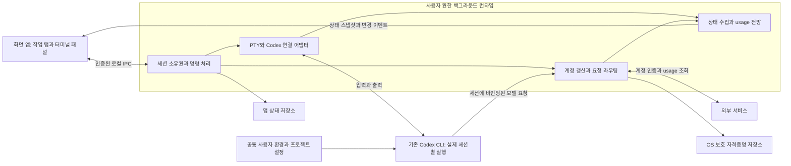

# Codex 작업 공간: 실행 토폴로지와 업데이트 경계

작성일: 2026-09-13. 상태: r2 독립 설계 검수 PASS, 아키텍처 채택. 구현 코드는 아직 없다.

목적은 사용자·프로젝트 환경을 유지하면서 계정 선택과 복구를 자동화하고, 창이 닫혀도 작업을 지속하는 것이다. 사용자는 구조 검수에서 중대한 문제가 없으면 이 방향으로 진행하도록 승인했다. 설계 검수 통과는 실제 동작·성능·업데이트 안전성 검증과 구분한다.

## 1. 범위와 핵심 선택

Windows PowerShell·CMD가 첫 대상이며 macOS는 후속 대상이다. 관리자 서비스·컨테이너·세션별 강제 worktree는 도입하지 않는다. 첫 버전은 같은 컴퓨터의 OS 사용자당 제품 런타임 하나로 제한하며 다중 앱 프로필을 지원하지 않는다. 앱 설치 사본·UI 창이 여러 개여도 동일 소유자에 연결한다. 사용자 권한의 백그라운드 런타임이 세션과 계정을 소유하며 UI는 그 클라이언트다. 개발·시험용 격리 런타임은 합성 인증만 사용하고 실제 grant를 병행 보유하지 않는다.

프로세스 분리는 창 닫기 유지뿐 아니라 인증·프록시 수명을 명확히 하기 위해 채택할 설계 후보다. 한 프로세스 안에 화면만 숨기는 기존 최소안에서 한 단계 확장한 제안이며, 사용자가 요청한 독립 검수로 채택 여부를 정한다. 무중단 업데이트는 별도 출시 조건이므로 프로세스 분리만으로 기능 완료를 선언하지 않는다.

프로세스는 UI와 Runtime의 두 책임 단위에 집중한다. 상태 수집기·인증 서비스·프록시를 각각 독립 데몬으로 늘리지 않고 Runtime 내부 모듈로 둔다. 실제 Codex와 셸은 Runtime이 관리하는 자식 실행 단위다. 별도 영구 실행되는 업데이터 서비스는 두지 않는다.

## 2. 토폴로지

편집 가능한 다이어그램: [runtime-topology.mmd](runtime-topology.mmd).

그림의 모델 요청 화살표는 논리적 소유 관계다. 로컬 프록시가 실제 트래픽을 중계할지, 검증된 인증 공급 경로로 CLI에 전달할지는 G1 검증에서 정한다. 이를 이미 사용 가능한 단일 공개 API로 표현하지 않는다.

## 3. 데이터와 실행의 소유자

| 대상 | 소유자 | 규칙 |
|---|---|---|
| 실행 세션 ID·실행 인스턴스·작업 경로 | Runtime | 앱 세션 ID, Codex thread ID, 프로세스 식별자를 분리한다. cwd나 PID 하나로 세션을 식별하지 않는다. |
| 탭·패널 배치·읽음·검수 표시 | UI의 명령을 받아 Runtime이 저장 | UI 재시작과 무관하게 복원. 읽음·검수와 실제 실행 상태를 분리한다. |
| 입력·터미널 크기 | Runtime이 지정한 현재 화면의 입력 소유자 | 같은 세션을 여러 탭에 표시해도 PTY·CLI를 복제하지 않는다. 보이지 않는 패널은 resize하지 않는다. 활성 화면의 지정된 대표 패널만 크기를 정한다. |
| 실제 계정·고정 정책·원하는 모델·현재 모델 | Runtime | 계정 전환 명령은 UI가 요청하지만 확정 상태는 Runtime이 기록한다. |
| refresh token·갱신 버전 | 계정 모듈 | 같은 인증 grant의 갱신을 직렬화하고 최신 토큰으로 원자적 교체. 중복 import한 동일 grant도 중복 갱신하지 않는다. 서버 발급 후 저장 전 충돌 등 결과 불확실 상태는 재시도를 반복하지 않고 격리·복구 또는 재인증 대상으로 표시한다. |
| 계정 usage/status·리셋 전망 | 상태·계정 모듈 | 실제 상태 조회를 기준으로 갱신. 소비 추세로 전망하며 강제 사용 제한에 쓰지 않는다. |
| 사용자·프로젝트 설정 | 기존 사용자와 Codex 설정 체계 | 계정별 홈 전체 교체로 설정을 분리하지 않는다. 앱 소유 상태 DB와 설정 소유권을 혼동하지 않는다. |
| Codex 대화 기록 | Codex 기록 체계 | 앱 DB에 본문을 재구현하지 않는다. 외부 홈의 기록을 독립 이전하는 작업은 별도 importer가 담당한다. |

## 4. CLI와 인증 어댑터의 경계

기존 TUI를 유지한다. 런타임은 ConPTY/PTY와 CLI 실행을 관리하며, 상태 관측은 Codex가 제공하는 구조화 경로를 우선한다. 출력 정규식만으로 승인·완료를 확정하지 않는다.

우선 검증 형태는 실제 세션마다 관리되는 App Server 연결과 그 서버에 연결한 TUI다. 런타임이 스레드 시작·재개 결과의 ID를 추적하고 수동으로 임의 thread/resume을 중복 호출하지 않는다. 기존 소스에서 AuthManager 공유가 확인됐으므로 서로 독립된 계정 세션들을 같은 서버의 전역 로그인 변경으로 제어하지 않는다. App Server 수와 수십 세션 비용은 G2에서 측정한다. 이 형태가 부적합하면 어댑터를 교체하며 UI와 세션 계약은 유지한다.

계정 공급의 두 후보는 로컬 프록시와 외부 인증이다. 외부 인증은 현재 설치 CLI 스키마에 내부용·불안정이라고 명시돼 있으므로 안정된 기반으로 가정하지 않는다. 프록시도 세션별 식별, 재연결, ChatGPT Apps 호출, 모델 공급자 동작을 검증하기 전 확정하지 않는다.

라우팅을 구현한다면 세션별 난수 식별 자격증명을 Runtime이 발급해 세션과 연결한다. cwd·UI 탭 번호·클라이언트가 임의로 보낸 계정 ID를 라우팅 근거로 사용하지 않는다. 세션 정책의 세대 번호와 함께 계정 바인딩을 변경하고, 이미 시작한 요청의 계정 기록은 뒤늦게 바꾸지 않는다. 프로세스 시작 인자나 일반 로그에 실제 계정 토큰을 넣지 않는다.

Codex 환경을 공통으로 읽는 방식과 각 세션의 상태·캐시·인증 저장 경계는 G1에서 함께 검증한다. 모든 파일을 하나의 홈에 모아도 안전하다고 가정하지 않으며, 홈을 나눌 필요가 있으면 인증 기준이 아닌 실행 상태 격리 기준으로 공통 설정을 일관되게 해석할 어댑터를 검증한다. 검증 실패 시 구조 재검토를 허용한다.

## 5. 로컬 통신과 재연결

- OS 사용자당 제품 Runtime은 하나다. 설치 버전이나 UI 창별로 잠금 이름을 달리하지 않는다. 시작은 사용자 범위 배타 잠금으로 직렬화하고, 기존 프로세스의 인증된 handshake·실행 인스턴스 ID를 확인한 뒤 연결한다. 응답이 잠시 없다고 새 소유자를 즉시 만들거나 기존 프로세스를 종료하지 않는다.
- Windows named pipe, macOS Unix domain socket 같은 로컬 사용자 범위 전송을 우선한다. 해당 사용자 접근 제한과 별도 연결 인증을 둔다. localhost라는 이유만으로 신뢰하지 않는다. 동일 OS 사용자 전체를 적대 프로세스에서 완전히 격리하는 보장은 하지 않는다.
- Runtime만 앱 상태 DB를 기록한다. UI는 명령 ID와 기대 세대 번호를 보내며, 저장된 결과 또는 현재 상태를 다시 조회한다. 비밀값은 UI에 주지 않고 별칭·실제 사용 계정 식별에 필요한 표시 정보만 제공한다.
- 세션 생성은 실행 시도 ID를 먼저 저장하고 결과를 연계한다. 생성 중 단절됐다고 같은 세션을 다시 생성하지 않는다. 프로세스는 살아 있지만 소유권을 확인할 수 없으면 중복 실행 대신 확인 필요 상태로 둔다.
- UI 입력은 입력 소유권과 순번을 확인한다. 전송 성공 여부가 모호한 PTY 바이트를 자동 재전송하지 않는다. 구조화 명령의 중복 방지와 원시 키 입력은 구분한다.
- 재연결은 Runtime 인스턴스·세션 세대·이벤트 순번을 기준으로 스냅샷과 그 이후 변경을 받는다. 출력 공백이 있으면 스냅샷을 다시 받는다. 네트워크 단절을 작업 완료로 표시하지 않는다.
- 표준 터미널 화면 상태·현재 크기·UTF-8 및 ANSI 스트림 해석 상태는 Runtime의 화면 에뮬레이터가 소유한다. UI가 없어도 계속 갱신하며 여기서 재연결 스냅샷을 만든다. 중간에서 잘린 바이트를 처음부터 유효한 스트림인 것처럼 재생하지 않는다.
- 터미널별 메모리 버퍼·스크롤백·스냅샷 크기를 제한한다. 느린 UI 때문에 PTY 출력을 무한히 쌓지 않는다. 표시용 중간 출력은 새 스냅샷으로 대체할 수 있지만 승인 요청·계정 변경·오류·종료 같은 제어 상태는 재조회 가능하게 보존한다.

## 6. 종료와 복구 규칙

창·패널·탭 닫기는 세션 종료가 아니다. Runtime은 UI 없이도 인증 갱신·계정 usage 조회·허용된 복구·리셋 대기를 수행한다. 승인이나 사용자 응답이 필요한 작업은 기다리며 UI 부재를 승인으로 취급하지 않는다.

세션 종료·삭제 명령이 접수되면 먼저 세대 번호를 올리고 종료 의도를 저장해 예약된 자동 재개·갱신 후 재시도를 무효화한다. 삭제 tombstone은 재연결이나 오래된 타이머로 세션이 부활하는 것을 막는다. 종료가 확인된 뒤 프로세스 기록을 정리하며 대화와 프로젝트 파일은 보존한다.

‘빈 Runtime’은 연결된 UI가 없고, 살아 있는 셸·CLI·자식 작업, 생성 중 작업, 자동 재개 예약이 없는 상태다. 입력 대기·한도 리셋 대기·검수 전 응답은 각각 다른 상태이며 침묵을 빈 상태로 판단하지 않는다. 재개 예약만 있어도 Runtime을 유지한다. 모든 소유 작업이 없어지면 종료할 수 있고 다음 앱 시작 시 다시 실행한다.

Runtime 충돌·OS 재시작 시 원래 프로세스 유지까지 보장하지 않는다. 실제 프로세스 소유권이 불명확하면 임의 재실행·PID 기반 종료를 하지 않는다. Windows 자식 프로세스 종료·소유권은 전용 어댑터로 검증하며 OS가 지원하는 프로세스 그룹/Job 등 정확한 소유 관계를 사용한다. UI만의 종료와 Runtime 종료를 동일한 OS 소유 그룹으로 묶지 않는다.

저장된 Codex 기록 재개는 살아 있는 프로세스에 attach하는 것과 별개다. 마지막 사용자 요청이나 도구 실행을 무조건 다시 보내는 자동 복구는 하지 않는다. 안전한 재시도 근거가 없으면 재개 판단을 사용자에게 넘긴다. 이 제한은 한도·인증 실패 시 허용한 자동 복구에도 적용한다.

## 7. 업데이트: 하나의 실행 버전만 유지

첫 정책은 OS 사용자당 제품 Runtime 한 버전만 실행하는 것이다. 새 UI가 기존 Runtime과 호환되면 UI만 교체하고 다시 연결한다. 구·신 Runtime에 새 작업을 나눠 배정하는 다중 세대 실행과 무제한 구버전 지원은 도입하지 않는다.

Runtime/Codex/프록시와 그 의존 파일은 실행 동안 특정 버전에 고정한다. 업데이트가 실행 중 파일을 덮어쓰지 않도록 별도 배포 단위와 버전 디렉터리를 사용한다. 화면 업데이트 설치 프로그램이 실행부를 이름이나 설치 경로 범위로 함께 종료하지 않도록 패키지 수준에서 검증한다. 기존 앱 바이너리를 실행 중 복제·이름 변경하는 생존 기법은 기본 구조로 삼지 않는다.

Runtime 변경이 필요하면 활성 작업이 끝날 때까지 적용을 연기한다. 기존 작업을 강제로 옮기지 않는다. 사용자가 셸을 계속 열어 두면 적용이 오래 지연될 수 있으며 이를 알린다. 긴급 수정은 작업 보존과 즉시 적용을 동시에 보장할 수 없으므로 명시적 종료·재개 경로로 처리한다.

호환성 handshake를 업데이트 적용 전에 수행한다. 호환 불가라면 새 UI 활성화를 보류하고 기존 UI를 유지한다. 상태 DB 형식 변경은 UI가 하지 않는다. Runtime 업데이트 때 소유 작업이 없는 것을 확인한 뒤 백업·마이그레이션·검증을 수행한다. 구버전으로 되돌릴 수 없는 DB를 실행 파일만 다운그레이드해서 열지 않는다. 사용 중인 버전은 정리하지 않는다.

교체를 시작할 때 Runtime은 먼저 `update-locked` 상태로 전환해 새 생성·재개·자동 재개 접수를 잠근 뒤, 진행 중 생성과 예약까지 포함해 비어 있는지 다시 확인한다. 종료·취소·상태 조회는 계속 허용한다. 비어 있지 않으면 적용을 중단하고 정상 접수를 복원한다. 실제 교체 구간에는 수명이 짧은 업데이터가 같은 사용자 범위 잠금의 인계를 받아 새 런타임 시작을 막고, 기존 Runtime 종료·DB 닫힘을 확인한 뒤 저장소를 변경한다. 별도 상시 업데이터 서비스는 필요 없다. 업데이트 단계와 복구 가능한 버전을 기록해 충돌 후에도 진행 상태를 판정하며, 실패 시 검증된 이전 상태로 복구한 뒤 정상 접수를 열거나 복구 필요 상태를 명시한다. 잠금만 해제하고 미완성 DB를 정상 실행하지 않는다.

초기에는 자동 업데이트를 활성화하지 않아도 된다. 창 닫기·다시 연결하기를 먼저 검증하고, 실제 설치 패키지로 G4를 통과해야 ‘업데이트 중 작업 유지’를 기능으로 표시한다.

## 8. 구현 전후 검증 관문

| 관문 | 검증 | 통과 전 제한 |
|---|---|---|
| G1: CLI·인증 경계 | 동일 환경에서 A/B 계정 격리, 갱신 단일 소유, 토큰 발급 후 저장 전 충돌, 실제 요청 계정 확인, 프로젝트 스킬·MCP·권한 보존, 기존 대화 재개 | 프록시/외부 인증 중 하나를 확정하거나 자동 전환 완성 주장 금지 |
| G2: 터미널·상태 | PowerShell·CMD, 여러 탭 한 세션, 입력·resize 소유권, 한글 IME·대체 화면·출력 폭주·느린 UI, 승인·실패·관측 끊김, 최소 30세션과 50세션 부하 특성 | 수십 세션 지원과 완전한 상태 정확성 보장 금지 |
| G3: 수명주기 | UI 강제 종료·재연결, UI 부재 중 인증 갱신·승인 대기·리셋 후 재개, Runtime 시작 경쟁, 생성 중 단절, 취소 대 재시도, 삭제 후 재연결, 자식 프로세스 소유권, 장시간 백그라운드 | 자동 복구와 프로세스 분리의 신뢰성 통과 처리 금지 |
| G4: 배포 | 실제 구→신 패키지, UI 호환/비호환, 적용 직전 생성·예약 재개 경쟁, 설치 실패·롤백·잠금 인계 중 충돌, 사용 중 버전 보존, 전체 종료 후 정리 | 무중단 업데이트 출시 금지 |

G1은 우선 합성 인증·임시 홈·로컬 모의 서비스로 검증하고, 실제 서비스의 동작은 별도 명시한 통합 시험에서 확인한다. 미관측 요청·도구 권한 차이는 모의 시험만으로 통과 처리하지 않는다.

첫 구현 순서: 세션과 공통 환경·인증 경계의 최소 실험 → Runtime과 한 패널 연결 → 다중 탭/세션과 수명주기 → 계정 전망·복구 → 패키지 업데이트 검증. 제품 화면 전체를 만든 뒤 인증 경계가 불가능함을 발견하지 않도록 한다.

## 9. 근거와 독립 검수

[요구사항 결정 기록](2026-09-13_design-codex-workspace-report.md), [Codex 설정·인증 분석](2026-09-13_codex-config-auth-analysis.md), [Orca 수명주기 분석](2026-09-13_background-update-analysis.md)을 근거로 한 설계다. 소스 사실은 링크된 분석의 해당 기준 커밋에 한정된다. 이 문서의 나머지는 구현 제안과 검증 조건이다.

독립 검수: `runtime_arch_review`의 r1 검수는 수정 필요였다. (1) 업데이트 직전 새 작업 접수 경쟁과 (2) 여러 프로필의 동일 grant 갱신 소유권 충돌을 지적했다. r2는 update-locked 상태·잠금 인계·실패 복구와 단일 사용자 런타임 제약을 추가했다. 비차단 보완인 토큰 갱신 결과 불확실성, Runtime 소유 터미널 화면 상태, 구체적인 IME·백그라운드 시험도 반영했다.

r2 최종 판정은 **PASS: 아키텍처 채택과 G1 최소 실험 착수 가능**이다. 검수자는 추가로 발견한 차단 수준의 설계 결함이 없다고 보고했다. 이는 무결함 보장이나 구현·출시 PASS가 아니다. 사용자의 사전 조건부 승인에 따라 토폴로지를 채택하며, 인증 공급 경로는 G1에서 결정한다. 실제 실행 검증 결과는 아직 없다.

문서 검증은 근거 링크, 별도 Mermaid 파일과 본문 도식 일치, r1 지적의 수정 반영을 확인했다. SVG 렌더링은 로컬 `mmdc`가 없어 완료하지 못했으며 편집 가능한 Mermaid 원본을 제공한다. [검증 기록](runtime-architecture-verification.json)에 이 한계와 실행 시험 미수행을 기록했다.
