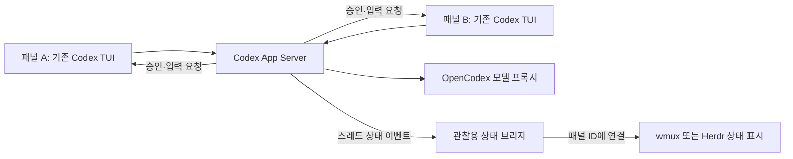

# Codex 다중 터미널 상태 감지와 도구 선택

**권고는 ‘기존 터미널에 Codex App Server 상태 브리지를 연결하고, 필요한 표시만 수정하는 것’이다.** Windows GUI 기반의 첫 구현 대상으로는 wmux가 적합하다. 상태 입력 API와 패널별 표시가 이미 있어, 처음부터 터미널을 만들거나 Codex를 포크할 이유가 작다. 터미널 내부의 타일 UI도 괜찮다면 Herdr가 유력한 대안이다. 완제품만 사용하려면 Herdr를 먼저 평가하되, 기본 Codex 감지가 여전히 제목·화면 규칙에 의존한다는 한계를 받아들여야 한다.

판단의 핵심은 화면 배치보다 상태의 출처다. Codex가 직접 제공하는 실행 상태를 받으면 출력이 없는 추론, 오래 걸리는 도구 실행, 실제 사용자 승인, 사용자 입력 요청을 구분할 수 있다. 화면 정규식과 로그 감시만으로는 이 구분을 일관되게 보장하기 어렵다.

**검증 범위**

2026년 9월 12일 기준으로 Codex, wmux, Microsoft Intelligent Terminal, Agent Terminal, trafficlight4ai, Wave Terminal, Herdr, Codex Monitor HUD, OpenCodex 등 9개 저장소를 얕은 복제로 확보했다. 전체 변경 이력을 받은 것은 아니지만, 각 저장소의 해당 커밋 작업 트리는 로컬에 있다. 전체 SHA와 원격 주소는 [repository-manifest.json](repository-manifest.json)에 기록했다.

Codex는 조사 시점 main 소스와 설치된 CLI 0.154.0을 구분했다. 실행 시험에는 설치된 공식 패키지의 Windows 바이너리를 직접 사용했다. 비교를 위해 `rust-v0.154.0` 태그도 가져왔으며, 태그 SHA는 `36eab01061df3cde5f95ec20a526777b430091ba`다. 주요 App Server 상태 관리와 rollout 저장 정책 파일은 이 태그와 조사 main 사이에 차이가 없었다. TUI 제목 파일에는 후속 변경이 있으므로 main 전체를 0.154.0과 동일하다고 취급하지 않는다.

실행 시험은 별도의 Codex 홈과 작업 폴더, 로컬 모의 Responses 서버에서 수행했다. 실제 계정이나 모델을 사용하지 않았다. Windows 터미널 제품의 설치·GUI 조작·장시간 사용·OpenCodex 실제 계정 라우팅은 검증 범위에 포함하지 않았다. ‘상태 경로 검증’과 ‘완제품 채택 확정’은 구분해야 한다.

**1. 현재 요구에 맞는 선택**

| 선택 | 얻는 것 | 남는 일 | 판단 |
|---|---|---|---|
| Herdr 그대로 사용 | 여러 패널, 상태 집계, 주의 필요 세션 탐색 | 기본 Codex 감지의 오판 가능성·한글 입력 확인 | 수정 없는 후보 중 먼저 평가 |
| wmux + 외부 상태 브리지 | 기존 GUI·패널별 표시에 정확한 Codex 상태 공급 | 실행 연결·패널 식별·연결 끊김 처리 | 가장 적합한 첫 구현 방향 |
| wmux + 브리지 + 작은 UI 수정 | 승인/입력/완료/오류를 각 패널에 분명하게 표시 | 상태 필드와 색상·아이콘 확장 | 최종 요구에 가장 가까운 목표 |
| Herdr + 외부 상태 브리지 | 기존 터미널 UI에 정확한 상태 공급 | 브리지와 플랫폼별 입력 검증 | GUI 도킹이 부차적이면 경쟁력 있음 |
| Intelligent Terminal 수정 | Windows 네이티브 터미널과 세션 관리 활용 | 훅·로그·ACP 경로 정리, 패널별 표시 설계 | 가능하지만 첫 수정 대상으로는 범위가 큼 |
| 새 터미널 앱 개발 | 원하는 화면을 전부 설계 | PTY·IME·복원·입력·배포까지 담당 | 기존 제품의 사용성 시험 후 판단 |
| Codex 자체 포크 | 내부 이벤트를 임의 방식으로 내보내기 | Codex 업데이트 추종·배포 | 현재 버전에서는 우선순위가 낮음 |

wmux를 추천하는 이유는 기본 Codex 감지가 우수해서가 아니다. 이미 있는 GUI와 외부 상태 입력 경로를 활용해 그 감지를 대체할 수 있기 때문이다. 3상태만 먼저 연결하는 단계에서는 wmux 소스 수정 없이도 접근할 수 있다. 다만 오류·연결 단절·완료 확인 여부까지 정확하게 표현하려면 작은 UI·상태 모델 확장이 필요하다.[^1][^2]

**2. Codex에서 상태가 생기고 전달되는 구조**

Codex의 실행 엔진은 턴 시작·종료, 도구 실행, 승인 요청, 사용자 입력 요청 등을 이벤트로 내보낸다. App Server는 이 이벤트를 받아 스레드별 실행 여부와 미해결 요청 수를 관리한다. TUI는 그 서버의 클라이언트로 동작할 수 있다. 최신 소스에는 프로세스 내부 서버와 외부 서버 양쪽을 이용하는 경로가 있다.[^3][^4]

일반 CLI가 실행 중이라는 이유만으로 임의의 별도 App Server에서 그 CLI의 메모리 상태가 보이는 것은 아니다. 관찰 대상은 **관찰 클라이언트와 같은 App Server에 연결된 스레드**다. 기존 CLI를 계속 독립적으로 실행한다면 제목·훅 같은 다른 경로가 필요하다. `--remote`로 실행 경로를 명확하게 통일하면 이 경계를 관리할 수 있다.

Windows에서도 0.154.0의 도움말에 `codex --remote ws://…`가 노출되며, 이번 실행 시험에서 Windows App Server의 WebSocket 연결이 작동했다. 자동으로 공용 데몬에 연결하는 별도 경로도 소스에 있지만, 실행 옵션과 환경에 따라 내부 서버로 갈 수 있으므로 이를 전제로 모든 CLI가 자동 집계된다고 가정하면 안 된다.[^4]

이 그림은 역할을 설명하는 목표 구조다. 두 TUI의 실제 화면을 띄운 통합 시험 결과는 아니다. 실행 시험에서는 TUI 대신 두 개의 작업용 프로토콜 클라이언트를 사용했고, 별도의 관찰 연결이 상태를 받는지 확인했다.

**App Server가 제공하는 상태**

`thread/status/changed`는 `threadId`와 `status`를 전달한다. 상태는 `notLoaded`, `idle`, `systemError`, `active`이며, `active`에는 `waitingOnApproval`과 `waitingOnUserInput` 플래그가 붙을 수 있다. 내부 구현은 미해결 승인·입력 요청을 카운터로 관리하고, 요청 처리가 끝나면 해당 카운터를 해제한다. 단순한 ‘마지막 이벤트 한 개’보다 병렬 요청을 다루기 좋은 구조다.[^5]

`idle`은 성공 완료를 의미하지 않는다. 턴 결과는 별도의 `completed`, `interrupted`, `failed`, `inProgress`로 표현된다. 실제 시험에서도 정상 완료와 사용자 중단이 모두 스레드 `idle`로 끝났다. 따라서 초록색 완료 표시를 만들려면 마지막 턴의 결과를 추가로 확인해야 한다.[^6]

관찰 연결은 스레드를 `resume`하지 않고 상태 방송을 받았다. 관찰자가 상태를 얻기 위해 활성 스레드를 다시 실행하거나 승인을 대신 처리할 필요가 없다는 뜻이다. 단, 이것은 해당 연결을 읽기 전용으로 제한하는 서버 권한 체계가 있다는 뜻은 아니다. 브리지 자체가 조회·관찰만 수행하도록 구현해야 한다.

**3. 실제 실행 시험 결과**

| 항목 | 시험 | 결과 |
|---|---|---|
| 기본 실행 상태 | 작업 클라이언트 1개 + 관찰 클라이언트 1개 | 관찰자가 `active → idle` 수신 |
| 승인 대기 | 모의 모델이 승인 필요 명령을 제안, 작업 클라이언트에서 거절 | `active → waitingOnApproval → active → idle` 수신 |
| 입력 대기 | 모의 모델이 Plan 모드의 사용자 입력 도구 호출 | `active → waitingOnUserInput → active → idle` 수신 |
| 요청 소유권 | 승인·입력 시험의 관찰 연결에 서버 요청이 오는지 확인 | 관찰 연결의 요청 수 0 |
| 동시 세션 | 별도 작업 클라이언트 2개가 각각 턴 실행 | 서로 다른 두 스레드의 `active` 확인 |
| 관찰 연결 복구 | 두 턴이 활성 상태일 때 관찰 연결만 재연결 | 두 스레드 모두 조회 결과 `active` |
| 완료와 중단 | A는 모의 응답 완료, B는 해당 턴만 중단 | 결과가 각각 `completed`, `interrupted` |
| 가벼운 결과 조회 | `thread/turns/list`, `limit: 1`, `itemsView: notLoaded` | 본문 없이 두 턴의 결과 조회 성공 |
| 실패 | 로컬 모의 서버가 HTTP 500 반환 | 턴 `failed`, 스레드 `systemError` 확인 |

승인 시험의 명령은 실행하지 않고 거절했다. 이 시험은 실제 모델 성능, 계정 속도, 터미널 렌더링을 측정하지 않는다. 정확한 상태를 외부에서 받을 수 있는지 검증한 것이다.

원시 결과와 이벤트는 다음 폴더에 있다.

- [기본 상태 시험](probe-7h7_rnf1/result.json), [이벤트](probe-7h7_rnf1/events.json)
- [승인·입력 시험](probe-approval-k7jus_lt/result.json), [이벤트](probe-approval-k7jus_lt/events.json)
- [동시 실행·복구·결과 조회 시험](probe-reconnect-jnf1sfom/result.json), [이벤트](probe-reconnect-jnf1sfom/events.json)
- [실패 및 초기 시도 기록](probe-concurrent-1lygr01j/result.json), [이벤트](probe-concurrent-1lygr01j/events.json)

초기 시도에서는 두 가지 구현상 주의점도 드러났다. 턴 제출 응답 직후에는 실제 실행 상태 전환보다 조회가 먼저 도착해 `idle`을 볼 수 있었다. 또 `itemsView: none`은 잘못된 값이며, 올바른 값은 `notLoaded`였다. 수정된 시험은 활성 이벤트를 확인한 뒤 재연결했고, 두 스레드의 활성 상태와 마지막 턴 결과를 정상 조회했다. 초기 실패 기록도 그대로 보존했다.

**4. 감지 방식별 근본적인 정확도**

| 방식 | 잘하는 것 | 놓치거나 오판하기 쉬운 것 | 권장 역할 |
|---|---|---|---|
| App Server 상태·턴 결과 | 실행, 실제 승인/입력 대기, 중단·오류 구분 | 같은 서버 밖의 CLI, 연결이 끊긴 구간 | 주 상태 공급원 |
| Codex의 OSC 제목 | TUI가 표시하는 활동·개입 필요 상태 | 설정 의존, 완료/중단 구분, 문자열 변경 | 기존 CLI의 빠른 보조 경로 |
| 공식 훅 | 세션·프롬프트·도구·중단 경계와 ID | 승인 확정 시점, Stop 이후 계속 실행 | 보조 신호·세션 연결 |
| rollout/이력 감시 | 턴 경계·사용량·과거 기록 | 실제 승인·입력 요청, 저장 지연·형식 변경 | 이력·사용량 보조 |
| 화면 정규식 | 시작 메뉴·신뢰 질문 등 UI 전용 화면 | 화면폭·버전·언어·스크롤·인용문 | 낮은 신뢰도의 보완 |
| 프로세스·출력량 | 프로세스 생존과 출력 활동 | 추론과 대기 구분, 무출력 장기 작업 | 생존 확인 |
| legacy notify | 턴 완료 알림 | 실행 중·승인·입력 대기 전체 | 완료 알림만 |
| `codex exec --json` | 비대화식 작업의 이벤트 스트림 | 기존 대화형 TUI를 그대로 관찰 | 배치 작업용 별도 선택 |

**로그 감시가 완전한 해결책이 아닌 이유**

Codex의 rollout 저장 정책은 `ExecApprovalRequest`, `RequestPermissions`, `RequestUserInput`, `ElicitationRequest`, `ApplyPatchApprovalRequest` 등을 일시적인 이벤트로 분류해 저장하지 않는다. 이력 파일에서 명령 호출은 보더라도, 그 명령이 실제로 사용자 승인을 기다리는지는 같은 수준의 사실로 복원할 수 없다.[^7]

예를 들어 `sandbox_permissions=require_escalated`는 모델이 권한 확대를 요청했다는 사실이다. 요청이 자동으로 처리되거나 정책에 의해 거절될 수도 있으므로 ‘현재 사용자가 승인해야 한다’는 사실과 같지 않다. 최신 이력에는 페이지화된 저장 구조도 있어, 기존 `response_item/function_call`만 보는 파서는 형식별 검증이 필요하다.

**훅만으로도 부족한 이유**

`PermissionRequest` 훅은 승인 처리 과정의 앞부분에서 실행된다. 현재 소스의 순서는 훅, 자동 심사 또는 사용자 승인이다. 다른 훅이 허용·거절하거나 자동 심사가 처리할 수 있으므로 이 훅 한 번만 보고 사람을 기다린다고 확정하면 오판한다.[^8]

`Stop`도 최종 턴 완료와 완전히 같지 않다. Stop 훅이 계속 작업하도록 요구하면 Codex는 추가 입력을 넣고 다시 실행할 수 있다. 관찰 훅이 먼저 완료 표시를 보냈다가 다른 훅 때문에 작업이 계속되는 상황을 고려해야 한다. `UserPromptSubmit`은 제출의 경계이지 실제 실행 개시 확인과도 구분된다.[^9]

훅은 stdout에 의도치 않은 지시·JSON을 내보내면 실행에 영향을 줄 수 있으므로 상태 브리지는 표시용 데이터만 별도 채널로 전달해야 한다. 특히 ‘에이전트에게 상태를 보고하라고 프롬프트로 지시’하는 방법을 핵심 감지 수단으로 삼을 이유가 없다. 실행 엔진의 이벤트를 이용하면 모델이 지시를 기억하고 도구를 호출할 필요가 없다.

**터미널 제목은 단순 화면 추정보다 낫지만 구조화 API는 아니다**

Codex는 내부 상태로 제목의 활동 표시와 `Action Required`를 구성하고, OSC 0으로 내보낸다. 개입 필요 판단에는 승인 화면뿐 아니라 질문·입력 관련 화면도 포함된다. 일반 작업 상태 문자열에는 `Starting`, `Ready`, `Working`, `Thinking`, `Waiting`이 있다.[^10]

여기서 `Waiting`은 백그라운드 터미널을 기다리는 상태일 수 있으므로 사용자 입력 대기와 혼동하면 안 된다. 또한 활동 항목을 제목에서 제거하면 개입 필요 표시가 빠질 수 있고, 애니메이션을 끄면 점자 스피너가 없어질 수 있다. ‘스피너가 없으면 유휴’라는 규칙은 이 설정에서 잘못 판단할 수 있다.

제목의 스레드 ID도 정확한 연결 키로 바로 사용하면 안 된다. 조사 소스는 이 항목을 32자로 줄이는데, 일반 스레드 UUID는 36자다. 표시용 제목으로 두 패널의 세션을 추정하는 설계보다, 실행 시점에 전체 스레드 ID와 패널 ID를 연결하는 설계가 낫다.[^10]

**5. 저장소별 구현 분석**

**wmux: UI와 외부 상태 입력을 활용할 대상**

Codex 화면 감지 파일은 v0.98 화면에 기반하며, 실행 중 화면을 확보하지 못해 `working` 규칙을 넣지 않았다고 명시한다. 현재 규칙은 일부 메뉴 대기와 입력창 유휴 판정이다. 이 부분을 제품 선택의 장점으로 볼 수는 없다.[^11]

반면 `pane.report_agent`는 외부에서 `awaitingHuman`, `runDepth`, `reason`, `seq`를 전달받는다. `wmux report-agent --surface …` CLI도 있다. 보고된 상태는 화면에서 감지한 상태보다 우선한다. 패널 탭의 표시와 전체 상태 목록이 같은 상태 선택 함수를 사용하므로 새 감지기를 기존 UI에 연결하기 좋다.[^1][^2]

권장 연결은 다음과 같다. `active`는 `runDepth=1`, 미해결 승인·입력은 `awaitingHuman=true`, 유휴는 `runDepth=0`으로 보낸다. 증감 이벤트만 누적하면 누락·재연결에 취약하므로 절대값을 사용하고 순번으로 중복을 제거한다. 상태 이벤트마다 CLI 프로세스를 띄우는 방법은 시제품에 쓸 수 있지만, 운영용은 기존 로컬 IPC를 이용하는 편이 낫다.

현재 패널 탭 CSS는 주로 `working`과 `blocked`에 작은 점을 표시하고, 유휴에는 표시하지 않는다. ‘각 창을 멀리서 보고 모두 식별’하는 요구라면 점을 조금 키우고 텍스트·아이콘·얇은 색상 테두리를 추가하는 편이 맞다. 오류, 연결 단절, 완료 확인 여부는 현재의 3상태로 억지로 표현하지 말고 별도 필드를 추가한다.[^12]

브리지 연결이 끊겼을 때 보고된 상태를 계속 신뢰하면 안 된다. 상태의 유효 시각과 연결 상태가 필요하다. `pane.release_agent`는 보고 권한을 놓는 데 쓸 수 있지만, 그 뒤 화면 추정으로 돌아갈 수 있으므로 이를 ‘정확한 상태 유지’로 해석해서는 안 된다. 이 부분은 최종 UI 수정 범위에 포함해야 한다.[^1][^2]

**Herdr: 그대로 사용할 후보이자 다른 브리지 대상**

Herdr는 터미널 내부에 여러 작업 패널과 상태 집계를 제공한다. 현재 Windows 문서는 ConPTY, 로컬 지속 세션, 상태 보고 통합을 지원한다고 설명한다. 다만 CJK IME 조합 위치와 한국어 입력 소스 전환은 부분 지원으로 남아 있어, 한국어 사용 환경에서는 반드시 실제 입력을 확인해야 한다.[^13]

Codex 매니페스트는 `Action Required` 제목, 점자 스피너, 시작·신뢰·승인 화면 문구를 조합한다. wmux보다 Codex 규칙이 풍부하지만, 제목 설정과 화면 표현에 따른 오판 가능성은 여전하다. 특히 평범한 비어 있지 않은 제목을 유휴로 판단하는 규칙이 있다.[^14]

외부 `pane.report_agent`는 의미 있는 상태를 받으며, 세션 ID를 별도로 보고하는 API도 있다. 따라서 같은 App Server 브리지를 Herdr 출력 어댑터로 연결할 수 있다. 기본 통합이 제공하는 세션 복원 정보와 실제 실행 상태 보고는 구분돼 있다.[^15]

현재 요구에서 Herdr의 장점은 상태 중심 작업 방식이 이미 있다는 점이다. 단점은 마우스 중심 Windows GUI와 다른 조작감, 한국어 입력의 플랫폼 제약, 기본 감지의 추정성이다. 상태 정확도를 브리지로 해결하고 실제 입력성이 괜찮다면 wmux 대신 선택할 수 있다.

**Microsoft Intelligent Terminal: 훅·로그·ACP가 공존한다**

Codex 훅 번들은 `SessionStart`, `PermissionRequest`, `UserPromptSubmit`, `Stop`을 `wtcli.exe agent-hook`으로 보낸다. 별도의 로그 분류기는 `task_started/task_complete`를 진행·유휴로 처리하고, 함수 호출 인자에서 권한 확대 요청을 찾아 주의 상태로 바꾼다.[^16][^17]

툴 출력이 끝났다는 이유로 턴 전체를 완료 처리하지 않도록 한 것은 적절하다. 하지만 권한 확대 인자를 실제 승인 대기로 해석하는 경로와, Stop 훅의 의미적 한계는 남는다. ACP 어댑터로 시작한 에이전트와 일반 CLI를 감시하는 경로도 구분해야 한다. 하나의 ‘Codex 지원’ 체크 표시로 동일한 정확도를 기대하면 안 된다.

기존 제품 채택 후보로는 가치가 있지만, 이번 요구에 맞춰 수정한다면 큰 Windows Terminal 기반 코드와 세션 관리 경로를 함께 다뤄야 한다. 상태를 별도 API로 주입하기 쉬운 wmux·Herdr보다 첫 구현의 범위를 줄이기 어렵다는 판단이다. 이 판단은 개발 범위에 대한 평가이며 성능 실측 결과가 아니다.

**Agent Terminal: 좋은 참고 코드지만 Windows 기반 선택에는 불리하다**

Codex 훅과 OSC 제목을 동시에 사용하고, 탭 ID를 환경 변수로 전달해 훅을 패널에 연결한다. 구조는 참고할 만하다. 그러나 Codex 프로필은 `Action Required`이면 차단, 점자 문자가 있으면 진행, 나머지 제목은 유휴로 판정한다.[^18]

통합 상태 함수에는 훅이 진행 상태인데 OSC가 1.5초 넘게 유휴면 유휴로 바꾸고, OSC가 없고 출력도 20초 없으면 진행을 유휴로 바꾸는 경로가 있다. 긴 무출력 추론을 중요하게 보는 사용에는 맞지 않는 기본 가정이다. 또한 훅의 차단 상태가 OSC 진행 신호만으로 항상 해제되는 구조도 아니다.[^19]

README는 Windows를 미시험으로 명시하고 ConPTY 및 셸 통합 작업을 요구한다. 이번 목적은 Windows 터미널 이식을 새로 맡는 것이 아니므로 우선 채택 대상에서 제외한다. 상태 결합·탭 식별 구현의 참고 자료로 활용하는 편이 적절하다.[^20]

**trafficlight4ai: 신호등 개념은 맞지만 다중 세션 보드가 아니다**

Codex 훅은 프롬프트·도구 시작을 빨강, 권한 요청을 노랑, Stop을 초록으로 보낸다. 기본 Codex 시간 제한은 300초이며, 상태 관리자는 시간이 지나면 유휴로 바꾼다. 오래 걸리는 무출력 작업이나 오래 방치한 승인 대기가 초록으로 돌아갈 수 있다.[^21]

IPC 명령에는 기본적으로 색상만 들어간다. 소켓별 인스턴스를 분리하는 것은 가능하겠지만, 한 화면의 모든 터미널과 세션 ID를 연결하는 통합 보드가 준비돼 있다고 볼 수 없다. 단일 보조 표시기나 색상 UX 참고용으로 적합하다.

**Codex Monitor HUD: 이력과 사용량 관찰에 적합하다**

파서는 턴 시작·완료·중단·토큰 사용량을 읽으며, 별도 상태 엔진은 이 정보와 관측 시간을 조합한다. 실제 승인 요청을 받는 구조화 경로와는 다르다. 로컬 기록을 중심으로 돌아가므로 별도 프런트엔드들을 폭넓게 관찰하는 장점은 있지만, 정확한 승인·입력 대기와 패널 연결 요구를 단독으로 충족하지는 않는다.[^22]

터미널을 그대로 두고 옆에 상태·사용량 HUD만 원한다면 검토할 수 있다. 한 앱의 각 패널 머리글에 정확한 상태를 넣는 이번 요구에서는 중심 도구보다 보조 자료에 가깝다.

**Wave Terminal: 배치에는 유리하지만 상태 모델은 추가 작업이 필요하다**

Wave에는 블록·탭 배지가 있고, 일반 배지는 포커스를 받으면 지워진다. PID 연결 배지는 예외 처리되지만, 해당 `wsh badge --pid` 경로는 Windows를 지원하지 않는다고 코드에 명시돼 있다. 따라서 Windows에서 기존 배지를 그대로 이용해 지속적인 승인 대기를 표시할 수 있다고 가정하면 안 된다.[^23]

단기 완료 알림에는 적합하지만, 상태가 실제로 해결될 때까지 남아 있어야 하는 보드에는 상태와 읽음 여부를 분리하는 수정이 필요하다. 배치가 최우선이었던 이전 비교와 달리, 현재 우선순위에서는 wmux·Herdr 뒤에 둔다.

**6. 권장 구현: 작은 브리지부터 만들고 필요한 UI만 바꾼다**

첫 단계는 기존 Codex TUI와 App Server를 연결하고, 서버 상태를 wmux에 전달하는 것이다. 상태 브리지는 모델 요청·계정 선택·도구 실행에 개입하지 않는다. 추론 요청은 기존 Codex 설정을 따라 OpenCodex로 간다. App Server와의 WebSocket은 UI 제어용 JSON-RPC이며, OpenCodex의 모델 Responses WebSocket과 다른 연결이다.[^3][^24]

**먼저 해결해야 할 것은 패널과 스레드의 정확한 연결이다.** 같은 폴더에서 두 Codex를 실행할 수 있으므로 작업 폴더로 추정하면 안 된다. `/new`, resume, fork로 스레드가 바뀌는 경우도 있다. 권장 식별자는 터미널의 `surfaceId/paneId`, 백엔드 실행 세대, 전체 `threadId`, 현재 `turnId`다.

초기 구현을 단순하게 하려면 **패널마다 전용 App Server를 하나 두는 방식**이 좋다. 브리지는 해당 서버와 패널의 관계를 실행 시점에 알고 있으며, 그 서버에서 시작·전환되는 최상위 스레드를 추적한다. 내부 서브에이전트를 별도 사용자 패널로 오인하지 않도록 출처와 부모 관계를 함께 확인한다. 여러 패널이 같은 Codex 홈과 OpenCodex 설정을 읽더라도, 백엔드 실행 인스턴스는 명확하게 구분한다.

하나의 공용 App Server로 합치고 싶다면 패널별 WebSocket 중계 연결에서 TUI의 스레드 시작·재개 응답을 관찰해 전체 ID를 연결하는 방식이 가능하다. 이 방식은 연결·응답 순서를 그대로 전달해야 하므로 초기 범위가 커진다. 공용 서버를 쓰면서 작업 폴더나 잘린 제목만으로 패널을 연결하는 방식은 피한다. 이 연결 설계는 제안이며, 이번 시험에서 구현한 완성 브리지는 아니다.

상태 브리지의 구독·복구 절차는 다음과 같이 구성한다.

1. 관찰 연결을 초기화하고 상태 이벤트 수신을 시작한다.
2. 연결된 패널의 전체 스레드 ID별 현재 상태를 조회한다.
3. 초기 스냅샷을 적용하는 동안 도착한 이벤트를 함께 정리해 더 오래된 값으로 덮어쓰지 않는다.
4. `active` 플래그를 진행·승인·입력 표시로 변환한다.
5. 유휴나 오류로 전환되면 마지막 턴 한 개의 결과를 조회한다.
6. 같은 턴 ID의 완료를 중복 알림하지 않고, 사용자의 확인 여부는 별도로 보관한다.
7. 연결이 끊기면 마지막 상태를 회색의 ‘연결 끊김’으로 표시한다. 완료로 추정하지 않는다.
8. 재연결하면 상태와 마지막 턴을 다시 조회하고 실시간 표시를 복구한다.

마지막 턴 조회는 `thread/turns/list`에 `limit: 1`, `sortDirection: desc`, `itemsView: notLoaded`를 전달하면 된다. 이 조합은 이번 실행 시험에서 동작했다. 완료 이벤트와 저장 반영 사이의 짧은 차이는 같은 턴 ID를 기준으로 제한적으로 재조회한다. 항상 전체 대화 본문을 읽을 필요는 없다.[^6]

**7. 각 패널에서 보여야 할 정보**

| 상태 | 권장 표시 | 의미 |
|---|---|---|
| 진행 중 | 파란 활동 아이콘 + ‘진행 중’ | 턴 실행 중이며 지금 사용자가 처리할 요청 없음 |
| 승인 필요 | 주황 방패/느낌표 + ‘승인 필요’ | 실제 미해결 승인 요청 있음 |
| 답변 필요 | 보라 질문 아이콘 + ‘답변 필요’ | 실제 미해결 사용자 입력 요청 있음 |
| 완료 | 초록 체크 + ‘완료’ | 마지막 턴이 정상 완료됨 |
| 중단 | 회색 정지 아이콘 + ‘중단’ | 취소·중단된 턴이며 성공 완료 아님 |
| 오류 | 빨간 오류 아이콘 + ‘오류’ | 턴 실패 또는 서버 시스템 오류 |
| 준비 | 중립색 점 + ‘준비’ | 아직 완료된 작업을 의미하지 않는 초기 유휴 |
| 연결 끊김 | 회색 연결 아이콘 + 마지막 관측 시각 | 현재 상태를 신뢰할 수 없음 |

색상만으로 구분하지 말고 아이콘과 짧은 글자를 같이 쓴다. 패널 전체를 계속 점멸시키기보다 상단 띠·머리글·얇은 테두리에 색상을 적용하는 편이 여러 창을 오래 보는 데 적합하다. 상태가 바뀌어도 패널 위치나 포커스를 자동으로 옮기지 않는다.

상단에는 ‘진행 4 / 승인 1 / 답변 2 / 완료 3’처럼 전체 집계를 두고, 주의가 필요한 패널로 바로 이동하는 동작을 제공한다. 탭 뒤에 숨은 세션도 집계한다. 패널을 바라봤다는 이유로 승인 대기를 없애지 않는다. 읽음 처리는 완료 알림에 적용하고, 승인은 실제 해결 이벤트로만 해제한다.

병렬 입력 요청이 있는 동안 다른 작업이 계속될 가능성도 고려해야 한다. 내부 상태는 ‘실행 여부’, ‘주의 필요 이유’, ‘마지막 결과’, ‘확인 여부’, ‘연결 신뢰도’를 분리한다. 표시할 때만 우선순위를 정한다. 평범한 자연어 답변 끝의 질문은 구조화된 입력 요청이 아닐 수 있으므로 그 경우까지 ‘답변 필요’를 보장하려면 별도 제품 정의가 필요하다.

**8. 수정 범위와 채택 기준**

| 구성 | 첫 구현 범위 | 후속 개선 |
|---|---|---|
| 실행 래퍼 | 패널 ID와 백엔드 연결을 묶고 기존 Codex TUI 시작 | 공용 백엔드·자동 복원 |
| Codex 상태 어댑터 | 구조화 상태, 마지막 턴 결과, 재연결 | 추가 승인 유형·비동기 질문·목표 모드 |
| wmux 출력 어댑터 | `pane.report_agent`에 절대 상태 전달 | 연결 유효성·상세 결과 필드 |
| 패널 머리글 | 진행/주의 상태를 분명하게 표시 | 완료/중단/오류/단절 아이콘 |
| 전체 목록 | 주의 필요 세션 이동·집계 | 사용량·계정 정보 보조 표시 |

Codex는 수정하지 않는 것을 기본으로 한다. wmux도 처음부터 포크하지 말고 외부 API로 상태를 넣는 단계부터 검증한다. 기본 3상태와 작은 점 표시로 충분하면 그 단계에서 멈출 수 있다. 모든 상태를 각 패널에서 명확하게 보려면 그때 UI와 데이터 모델을 수정한다.

wmux 수정이 필요해지면 확인할 파일도 좁힐 수 있다. `src/main/agent-state.ts`와 `agent-state-rpc.ts`에는 상태 출처·연결 유효성·마지막 턴 결과를, `src/renderer/store/agent-rollup.ts`에는 표시 우선순위와 집계를, `src/renderer/components/SplitPane/SurfaceTabBar.tsx`와 `src/renderer/styles/splitpane.css`에는 아이콘·문구·색상을 추가하는 범위가 첫 후보다. 브리지의 Codex 프로토콜 처리는 별도 모듈에 두어 터미널 감지 정규식과 섞지 않는다. 이는 변경 계획이며 해당 파일들을 수정한 것은 아니다.

복제본의 대표 라이선스 파일은 wmux·Intelligent Terminal·Agent Terminal·trafficlight4ai·Codex Monitor HUD·OpenCodex가 MIT, Codex·Wave·Herdr가 Apache-2.0이다. 실제 포크의 배포 범위를 정할 때에는 포함할 의존성과 자산도 함께 확인한다.

기존 제품을 최종 채택하기 전에는 실제 터미널 6개를 한 화면에 띄워 다음 시험을 통과해야 한다. 이 항목은 아직 수행하지 않았다.

| 시험 | 통과 기준 |
|---|---|
| 한글 입력 | 조합·삭제·여러 줄 붙여넣기가 정확함 |
| 동시 실행 | 한 패널의 입력·승인이 다른 패널에 영향을 주지 않음 |
| 장기 무출력 | 1분 이상 출력이 없어도 실행 중이면 진행 표시 유지 |
| 승인·답변 | 실제 요청 발생과 해제에 맞춰 표시 변경 |
| 패널 이동 | 재배치 후에도 같은 스레드 상태가 따라감 |
| 새 대화·재개·fork | 전체 스레드 ID 연결이 정확하게 바뀜 |
| 관찰 연결 단절 | 완료로 바뀌지 않고 단절 상태 표시 |
| 완료·취소·실패 | 서로 다른 결과를 표시 |
| 숨은 탭 | 전체 주의 목록에 계속 나타남 |
| OpenCodex | 실제 추론 요청이 의도한 프록시로 전달됨 |
| 창 닫기·복원 | UI 닫기와 백엔드 종료의 동작이 명시적임 |

목표 모드 자동 연속 턴, 여러 승인 동시 발생, 비동기 질문, MCP URL 인증 요청, 계정 재인증 화면은 추가 통합 검증 대상이다. `activeFlags`만으로 모든 UI 전용 로그인·설정 화면을 분류할 수 있다고 보증하지 않는다. 필요하면 OSC 개입 필요 신호를 ‘UI 확인 필요’라는 별도 보조 상태로 표시한다.

**최종 판단**

새 터미널을 만드는 문제보다 **Codex 상태를 정확하게 받아 기존 패널 UI에 연결하는 문제**로 범위를 잡는 것이 적절하다. 현 단계의 첫 선택은 wmux + 외부 App Server 상태 브리지다. 상태 입력이 검증된 뒤, 작은 점을 읽기 쉬운 아이콘·문구로 바꾸고 완료·오류·연결 단절을 추가한다.

수정 없이 바로 쓸 도구를 먼저 시험한다면 Herdr를 선택한다. 한국어 입력과 조작감이 만족스럽고 기본 감지의 제약을 수용할 수 있으면 그대로 사용할 수 있다. 정확도 요구가 높아지면 같은 브리지를 연결한다. 이 두 경로가 사용성 시험을 통과하지 못할 때 별도 앱 개발을 결정하는 순서가 합리적이다.

이 권고는 소스 분석과 Codex 프로토콜 실행 시험에 근거한다. 완성된 wmux/Herdr 연동 프로그램이나 모든 조건을 통과한 Windows 배포물을 제공했다는 의미는 아니다.

**출처**

아래 소스는 로컬 복제본과 동일한 커밋을 가리킨다. 실행 시험의 증거는 본문의 로컬 JSON 링크에 있다.

[^1]: wmux, [외부 상태 RPC](https://github.com/amirlehmam/wmux/blob/a185d26d6dd8de3060ae9139694f6a63c73b4812/src/main/agent-state-rpc.ts#L150), [CLI 상태 보고](https://github.com/amirlehmam/wmux/blob/a185d26d6dd8de3060ae9139694f6a63c73b4812/src/cli/wmux.ts#L1508).
[^2]: wmux, [보고 상태와 감지 상태의 우선순위](https://github.com/amirlehmam/wmux/blob/a185d26d6dd8de3060ae9139694f6a63c73b4812/src/renderer/store/agent-rollup.ts#L269).
[^3]: OpenAI Codex, [App Server 클라이언트 구조](https://github.com/openai/codex/blob/c4017a87aacc7558002b7cb510025e967c1d765e/codex-rs/app-server-client/README.md), [공식 App Server 문서](https://learn.chatgpt.com/docs/app-server).
[^4]: OpenAI Codex, [TUI 서버 선택](https://github.com/openai/codex/blob/c4017a87aacc7558002b7cb510025e967c1d765e/codex-rs/tui/src/lib.rs#L929), [remote CLI 옵션](https://github.com/openai/codex/blob/c4017a87aacc7558002b7cb510025e967c1d765e/codex-rs/cli/src/main.rs#L1058).
[^5]: OpenAI Codex, [스레드 실행 상태와 요청 카운터](https://github.com/openai/codex/blob/c4017a87aacc7558002b7cb510025e967c1d765e/codex-rs/app-server/src/thread_status.rs#L157), [상태 계산](https://github.com/openai/codex/blob/c4017a87aacc7558002b7cb510025e967c1d765e/codex-rs/app-server/src/thread_status.rs#L438).
[^6]: OpenAI Codex, [턴 결과 타입](https://github.com/openai/codex/blob/c4017a87aacc7558002b7cb510025e967c1d765e/codex-rs/app-server-protocol/src/protocol/v2/turn.rs#L32), [페이지별 턴 조회](https://github.com/openai/codex/blob/c4017a87aacc7558002b7cb510025e967c1d765e/codex-rs/app-server-protocol/src/protocol/v2/thread.rs#L1692).
[^7]: OpenAI Codex, [rollout 저장 정책](https://github.com/openai/codex/blob/c4017a87aacc7558002b7cb510025e967c1d765e/codex-rs/rollout/src/policy.rs#L94).
[^8]: OpenAI Codex, [훅·자동 심사·사용자 승인 순서](https://github.com/openai/codex/blob/c4017a87aacc7558002b7cb510025e967c1d765e/codex-rs/core/src/tools/approvals.rs#L493).
[^9]: OpenAI Codex, [Stop 훅 후 실행 지속 경로](https://github.com/openai/codex/blob/c4017a87aacc7558002b7cb510025e967c1d765e/codex-rs/core/src/session/turn.rs#L642), [legacy notify](https://github.com/openai/codex/blob/c4017a87aacc7558002b7cb510025e967c1d765e/codex-rs/hooks/src/legacy_notify.rs#L16).
[^10]: OpenAI Codex, [제목의 개입 필요 표시](https://github.com/openai/codex/blob/c4017a87aacc7558002b7cb510025e967c1d765e/codex-rs/tui/src/chatwidget/status_surfaces.rs#L317), [상태 문자열·스레드 ID 표시](https://github.com/openai/codex/blob/c4017a87aacc7558002b7cb510025e967c1d765e/codex-rs/tui/src/chatwidget/status_surfaces.rs#L936), [OSC 출력](https://github.com/openai/codex/blob/c4017a87aacc7558002b7cb510025e967c1d765e/codex-rs/tui/src/terminal_title.rs#L59).
[^11]: wmux, [미완성 Codex 감지 규칙](https://github.com/amirlehmam/wmux/blob/a185d26d6dd8de3060ae9139694f6a63c73b4812/src/shared/detection/manifests/codex.ts).
[^12]: wmux, [패널 탭 상태 표시](https://github.com/amirlehmam/wmux/blob/a185d26d6dd8de3060ae9139694f6a63c73b4812/src/renderer/styles/splitpane.css#L545), [표시 컴포넌트](https://github.com/amirlehmam/wmux/blob/a185d26d6dd8de3060ae9139694f6a63c73b4812/src/renderer/components/SplitPane/SurfaceTabBar.tsx#L118).
[^13]: Herdr, [Windows 지원과 제약](https://github.com/herdrdev/herdr/blob/9ad65d9031e8cb16a7b553c0e6f74809e9811e92/docs/versions/0.9.0/website/src/content/docs/windows-beta.mdx).
[^14]: Herdr, [Codex OSC·화면 감지 규칙](https://github.com/herdrdev/herdr/blob/9ad65d9031e8cb16a7b553c0e6f74809e9811e92/src/detect/manifests/codex.toml).
[^15]: Herdr, [상태·세션 보고 API](https://github.com/herdrdev/herdr/blob/9ad65d9031e8cb16a7b553c0e6f74809e9811e92/docs/versions/0.9.0/website/src/content/docs/socket-api.mdx#L695).
[^16]: Microsoft Intelligent Terminal, [Codex 훅 번들](https://github.com/microsoft/intelligent-terminal/blob/1e66cf55bf8bc6489b36f937dc9adc5a528ddb69/tools/wta/wt-agent-hooks/codex/wt-agent-hooks/hooks/hooks.json).
[^17]: Microsoft Intelligent Terminal, [Codex 로그 분류기](https://github.com/microsoft/intelligent-terminal/blob/1e66cf55bf8bc6489b36f937dc9adc5a528ddb69/tools/wta/src/session_watcher/classify_codex.rs).
[^18]: Agent Terminal, [Codex 프로필](https://github.com/DaniAkash/agent-terminal/blob/78d16febc3117c91264259196cb7b8d2fded4ca2/apps/desktop/src-tauri/src/agents/codex.rs), [훅의 탭 식별](https://github.com/DaniAkash/agent-terminal/blob/78d16febc3117c91264259196cb7b8d2fded4ca2/apps/desktop/src-tauri/src/hook_server.rs#L24).
[^19]: Agent Terminal, [상태 결합과 무출력 시간 제한](https://github.com/DaniAkash/agent-terminal/blob/78d16febc3117c91264259196cb7b8d2fded4ca2/apps/desktop/src-tauri/src/mod_engine/mods/agent_state.rs#L175).
[^20]: Agent Terminal, [플랫폼 지원 현황](https://github.com/DaniAkash/agent-terminal/blob/78d16febc3117c91264259196cb7b8d2fded4ca2/README.md#L94).
[^21]: trafficlight4ai, [Codex 훅 매핑](https://github.com/yhz61010/trafficlight4ai/blob/c9e45588f7374a2b61fdbd8c9b4bd9926277140c/src/AiToolStrategy.h#L23), [시간 제한 시 유휴 전환](https://github.com/yhz61010/trafficlight4ai/blob/c9e45588f7374a2b61fdbd8c9b4bd9926277140c/src/StateManager.cpp#L81).
[^22]: Codex Monitor HUD, [이력 파서](https://github.com/LH-03/codex-monitor-hud/blob/df1d5b9e3d4b701de979b5c84a006db7cca5112f/src-dotnet/CodexMonitorHud.Core/Parsing/HudRecordParser.cs), [상태 엔진](https://github.com/LH-03/codex-monitor-hud/blob/df1d5b9e3d4b701de979b5c84a006db7cca5112f/src-dotnet/CodexMonitorHud.Core/State/SessionMonitorEngine.cs#L390).
[^23]: Wave Terminal, [포커스 시 배지 해제](https://github.com/wavetermdev/waveterm/blob/a4447c1563b2df285ab89e76c82f91e1a1a49c1e/frontend/app/store/badge.ts#L53), [Windows PID 배지 제약](https://github.com/wavetermdev/waveterm/blob/a4447c1563b2df285ab89e76c82f91e1a1a49c1e/cmd/wsh/cmd/wshcmd-badge.go#L49).
[^24]: OpenCodex, [Codex 설정·프록시 통합](https://github.com/lidge-jun/opencodex/blob/c155cc7923dbc0102e27d79185505a85d4357b2c/docs-site/src/content/docs/guides/codex-integration.md).
